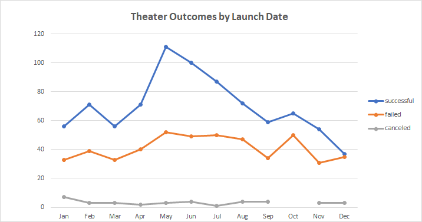
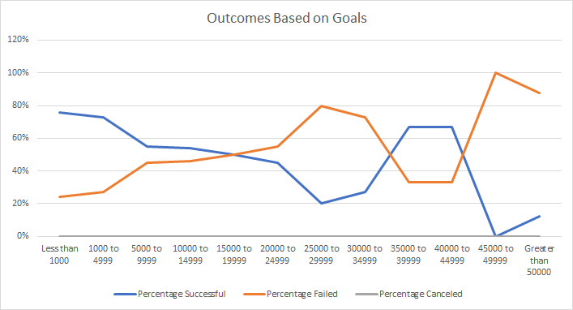

# Kickstarting with Excel
## Overview of Project

     
Based on the Kickstarter Dataset, 
     It has information about the "Shows/Programs" which are held in different countries with their goals, 
     pledge funding and outcomes if they(shows) are successful or failed.
     Those comes under various categories e.g., film, theater, television, animation etc.

## Purpose

   
     1. We need to find out category and their outcomes under period (launch date) of that program and goals 
        which are set to that program.
  
     2. We need to find out different activities over a particular period with launch dates and their funding goals.

## Analysis and Challenges

 

     1. Outcomes Based on Launch date.
    
     2. Outcomes Based on Goals.

## Analysis of Outcomes Based on Launch Date

**Theater Outcomes by Launch Date**

     1. To find out data with the help of Parent Category and Year with only "Successful”, “Failed", and "Canceled" outcomes.
     2. To find out monthly observations and show it into the chart.
     3. With the help of chart we can visualize the relationship between outcomes and launch month.

 

## Analysis of Outcomes Based on Goals

  **Plays Outcomes Based on Goals**

     1. We need to find out percentage of "Successful", "Failed”, “Canceled" outcomes of “Plays” from subcategory based on Goals.

     2. Vizualise it with the help of line chart.

    

## Challenges and Difficulties Encountered

     1. Theater Outcomes by Launch Date
          -It was tricky to use Year() function and use the fraction data for the "Year" column.
          -To filter on the pivot table only for "Successful", "Failed", "Canceled” data.

     2. Plays Outcomes Based on Goals
          1.How to use CountIfs() function as per the range given.
            -It was time consuming and difficult to understand.

          2.How to include "%" symbol on y axis in the line chart.  

## Results

     

          - What are two conclusions you can draw about the Outcomes based on Launch Date?

               1.In the month of May and June the success rate of theater category was high than other months.
               2.Cancelation rate is low over the period, that means theater category was successful.

          - What can you conclude about the Outcomes based on Goals?

               - We understood that Subcategory "Play" is successful,
                 but we cannot ignore that the number of failed outcomes are also increased over the period.
 
          - What are some limitations of this dataset?

               - As per the success rate we could find out the country graph,
                 but specific area of country is also important to understand the popularity of the shows.

          - What are some other possible tables and/or graphs that we could create?
        
               1. With the help of Pivot table we can find out which Parent category is successful or failed.
               2. Same for subcategory to find out which was popular in which country.
               3.  To find out Successful and Failed outcomes of country US.
               4. We can do conditional formatting on “Percentage Funded” and on “Average Donation”
                  with the help of color scales with “Highest” and “Lowest” value.

